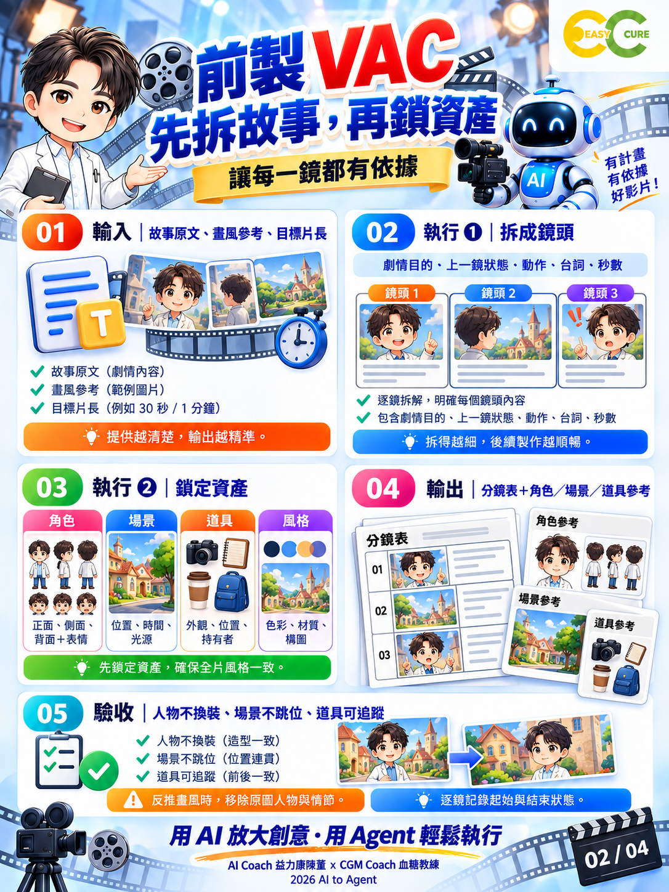

# 第 02 頁｜前製 VAC使用介紹

第二頁用來完成前製，把故事變成可以交接的鏡頭規格。先完整閱讀故事，確認人物關係、場景、時間與主要衝突，再依事件與情緒拆鏡，不要把文字機械式平均切成固定秒數。每一鏡至少記錄劇情目的、主體、動作、景別、台詞、時長，以及上一鏡留下的狀態。

接著建立四類可重用資產。角色準備正面、側面、背面與必要表情；需要全身動作時，補齊全身參考。場景記錄物件位置、時間與光源；道具記錄外觀、位置及持有者；風格則統一色彩、材質與構圖語言。參考圖不必一次做很多，但必須足以支援本集實際需要的鏡頭。

若從圖片反推畫風，應抽取光影、質感與配色，不把原圖人物、服裝與情節誤當成固定風格。分鏡交接時，也要記錄每鏡的起始和結束狀態，例如皇帝坐著、右手在桌上、茶杯位於右側。下一鏡若改變位置，就必須有劇情或動作銜接。

圖中的「人物不換裝」應理解為避免無故換裝，並非禁止劇情需要的服裝變化；場景與道具也是同樣原則。前製完成的標準，是另一位執行者只看分鏡與參考資產，就知道要生成什麼、哪些元素必須保持，以及如何判斷合格。最後輸出分鏡表與資產清單，交由導演核准，作為後續生成的共同依據。

實作時可先用表格把角色與鏡頭對照，找出哪些視角尚缺參考，再補做必要素材。不要只蒐集漂亮圖片而忽略可用性；最重要的是每份參考都有用途、版本與核准狀態，並能被後續任務清楚引用，減少重複解釋與誤用。

---

AI Coach 益力康陳董 x CGM Coach 血糖教練 | 2026 AI to Agent
