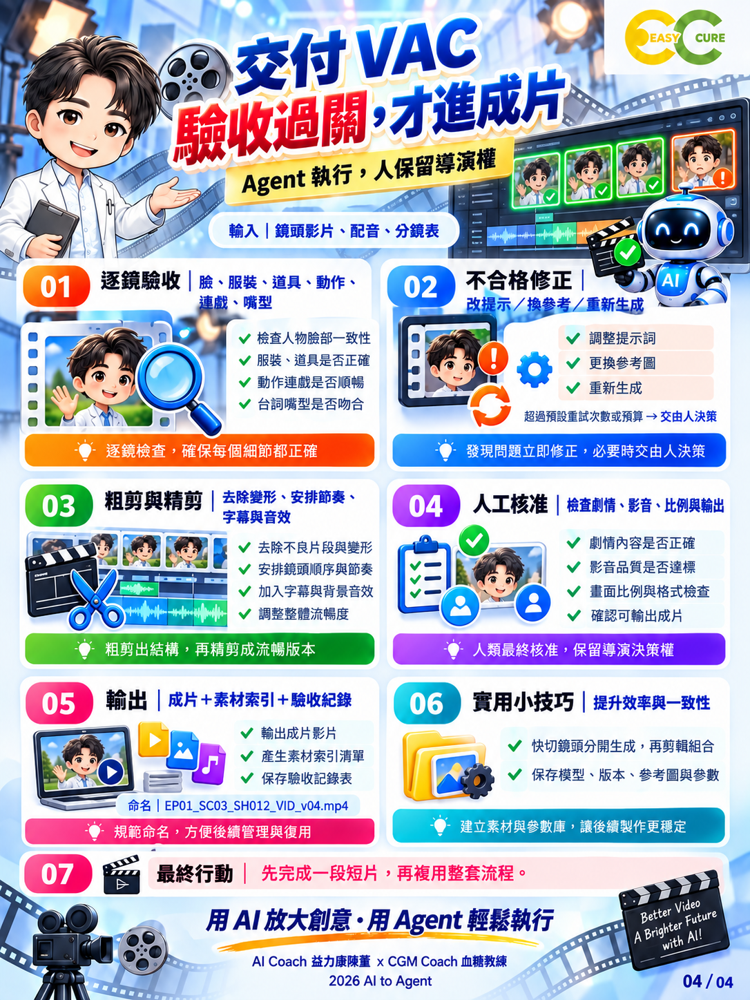

# 第 04 頁｜交付 VAC使用介紹

第四頁用於逐鏡驗收、剪輯與交付。先把鏡頭影片、配音及分鏡表放在一起對照，逐項檢查人物臉部、服裝、道具、動作、連戲與嘴型。檢查結果要記錄通過、失敗或不適用，並留下時間碼與原因，讓下一位接手者能快速找到問題，而不是重新觀看全部素材。

不合格鏡頭先判斷原因，再選擇修改提示詞、更換參考圖片或重新生成。若只有片尾變形，可以裁掉問題段落，但仍要確認剩餘時長足以表達劇情。當修正超過原定重試次數或預算時，由人決定是否更換鏡頭設計；不能讓Agent無限重試，也不能把未解決的問題直接標成通過。

粗剪負責選片、順序與節奏，精剪則處理字幕、配音、音效、轉場及整體一致性。多個特寫的快速切換，宜分鏡生成後再組合，方便精確控制。模型、版本、參考圖與參數都應保存，素材檔名則使用集數、場景、鏡號、類型與版本，避免最終版反覆覆蓋。

成片輸出前，由導演核對故事是否完整、字幕是否正確、影音是否同步，以及比例、解析度與格式是否符合用途。交付包應包含成片、素材索引、驗收紀錄及人工核准結果。先完成一段短片，確認整條流程能交接與回查，再複用到下一集；本頁提供的是工作規則，實際品質仍須逐片檢查。

最後可安排未參與製作的人觀看一次，檢查觀眾是否看得懂人物關係與事件因果。發現敘事不清時，回到分鏡處理，而不只增加字幕補救。保留最終核准版本及修改理由，才能讓下次製作真正沿用經驗，逐步降低溝通成本。

---

AI Coach 益力康陳董 x CGM Coach 血糖教練 | 2026 AI to Agent
