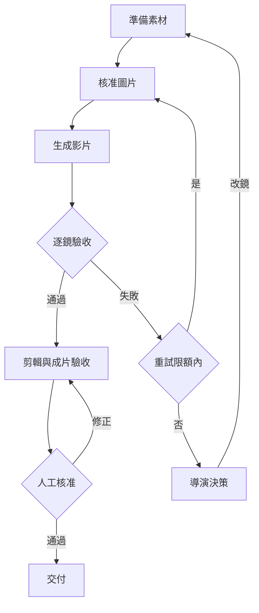

# 架構與八步驟 SOP

VAD：視覺化任務設計，用來溝通全局、依賴與決策。
VAC：可稽核、可交接的任務規格，定義輸入、動作、限制、輸出與驗收。
Agent：在已具備工具與權限的環境依VAC執行任務、留下證據並處理失敗。
人類導演：設定目標、核准資產、處理例外與最終放行。

## 八個關卡

| 步驟 | 輸入 | 執行重點 | 輸出／通過條件 |
|---|---|---|---|
| 1 理解劇情 | 故事、目標 | 世界觀、人物關係、衝突、受眾、用途 | 明確主題與製作簡報 |
| 2 拆解腳本 | 製作簡報 | 依事件、情緒及動作拆解，區分台詞與旁白 | 可拍腳本，保留必要情節 |
| 3 設計分鏡 | 腳本 | 目的、景別、運鏡、時長、前後狀態 | 有鏡號的分鏡表 |
| 4 鎖定資產 | 分鏡 | 角色、表情、場景、道具、畫風 | 核准參考與版本索引 |
| 5 生成圖片 | 分鏡與資產 | 五要素提示詞，核對可見物件 | 核准圖片；不合格回到圖片或資產 |
| 6 生成影片 | 核准圖片 | 動作、運鏡、情緒；依嘴型需求選路線 | 逐鏡影片、音訊、設定與逐鏡QC |
| 7 粗剪精剪 | 合格鏡頭 | 去除瑕疵、故事節奏、字幕與混音 | 待驗收成片 |
| 8 成片驗收 | 待驗收成片 | 全片預覽、技術格式與導演核准 | 成片、素材索引、驗收與核准紀錄 |

逐鏡QC發生在進剪輯前；成片QC發生在剪輯後，兩者不可互相取代。

## 狀態與失敗處理

## 前製細節

- 全身動作使用全身參考；正面、側面、背面是基礎，3/4視角可另補。
- 角色表情可包含平靜、喜悅、憤怒、悲傷、恐懼、驚訝。
- 場景記錄空間配置及光源方向；換場、換裝需明確劇情依據。
- 風格反推抽取材質、光影、色彩；移除原內容，不保證還原原提示詞。
- 同一固定場景的茶杯位置使用明確座標語意：人物自身右側或畫面右側，不能混用。
- 圖片提示詞：人物＋行為＋環境＋風格＋構圖。以可觀察狀態替代堆疊華麗形容詞。

## 生成與剪輯細節

- 影片提示詞：主體動作＋運鏡＋情緒＋環境動態＋目標時長。
- 臉部特寫不能驗證腿部姿勢；看不到的狀態以分鏡和資產另行約束。
- 需同步口型才使用口型路線；旁白、畫外音及反應鏡頭可分開製作。
- 長台詞先確定實際語音長度，再安排說話者與反應鏡頭，不硬塞進固定短秒數。
- 首尾幀可用於轉身、起身、移動等需要結束狀態的鏡頭；須先確認工具支援。
- 多個快切特寫分別生成，再由剪輯安排時長。不得將單張拼貼誤當已完成分鏡影片。
- 生成時長和有效片段分別記錄；裁切不能破壞必要動作或台詞。
- 同seed不保證跨模型、跨版本或不同提示詞下完全一致；如工具支援可保存以利追蹤。
- 失敗原因分為資產、提示詞、工具限制、剪輯或規格問題；只重做受影響環節。

## 範圍與限制

本專案是方法論與教學套件；未實作工具調度、API串接、自動品質評分或影片渲染。
不保證角色完全一致、不承諾任何模型效能；工具能力、費用與可用性需實際選定時確認。
